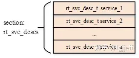

- [ATF代码结构](#atf代码结构)
- [bl1](#bl1)
  - [确定系统的引导启动路径](#确定系统的引导启动路径)
  - [体系结构初始化](#体系结构初始化)
  - [平台初始化](#平台初始化)
  - [固件更新检测和执行](#固件更新检测和执行)
  - [加载和执行bl2](#加载和执行bl2)
    - [加载前的平台准备工作](#加载前的平台准备工作)
    - [加载验证镜像](#加载验证镜像)
- [bl2](#bl2)
  - [基础初始化](#基础初始化)
    - [保存参数](#保存参数)
    - [设置异常向量表和SError](#设置异常向量表和serror)
    - [设置sctlr\_el1寄存器](#设置sctlr_el1寄存器)
    - [C运行时环境准备](#c运行时环境准备)
- [bl31](#bl31)
  - [启动工作](#启动工作)
  - [运行](#运行)
    - [运行时服务初始化流程](#运行时服务初始化流程)

# ATF代码结构
***bl1***, ***bl2***, ***bl31***这三个文件夹定义了TZ可信启动的基本阶段的通用流程。因为各个平台硬件结构不同，侧重不同，因此上述三个文件夹只是定义了通用接口，具体需要根据各个平台的特性实现。

***plat***包含了各个平台的实现文件，主要是实现上述blx的声明文件。

***service***是EL3的运行时服务文件，例如Secure-EL1 Payloads and Dispatchers(SPD, 就是TA的负载和调度器，负责EL3和EL1通信的，payload通常是TrustOS)。

***include***包含特定于ATF的所有库代码，即头部文件。

***common***包含与平台和架构无关的通用代码。

***lib***包含所有其他代码常用的功能。PSCI实现和其他EL3运行时框架驻留在库组件中。

***driver***包含通用平台的一些组件，例如clk、auth、smmu、tzc之类的，还有一些特定于平台的一些组件实现，但不完整。

# bl1
bl1是平台启动的第一个阶段，
其代码通常会被复制到受信任的SRAM（例如cache）中执行。

bl1所要完成的功能为
+ 确定系统的引导启动路径
+ 体系结构初始化
+ 平台初始化
+ 固件更新检测和执行
+ 加载和执行bl2

## 确定系统的引导启动路径
由于系统分为冷启动和热启动之分。当cpu从复位转变为运行时，bl1需要区分系统是冷启动和热启动。

冷启动是整个机器重新上电，一切都要重新初始化。在此情况下，选择一个cpu作为主cpu完成启动路径。其余的cpu作为辅助cpu根据平台的设定被置于特定的安全状态。

热启动是整个机器不断电，只需重新加载数据即可，程序不需要重启。在此情况下，cpu从单独的入口点继续执行。

## 体系结构初始化
即进行一些异常向量的初始化以及cpu初始化。

## 平台初始化
这是根据平台特性进行的操作，因此，具体需要在特定平台上实现。
在bl1中的主要操作为平台初期的初始化、平台体系结构初始化以及平台后期初始化。

具体需要初始化的操作有：
+ 启用可信看门狗。即负责平台的reset、计时等系统监控功能。
+ 初始化控制台（console）。
+ 配置AXI总线互联并enable硬件一致性。
+ 启用MMU并且映射其需要访问的内存。
+ 配置平台所需要的存储器接口等以加载下一个引导加载程序镜像。
+ 若bl1的动态配置文件TB_FW_CONFIG可用，则将其加载到平台特定的地址，并通过arg0传递给bl2供其使用。
+ 配置系统定时器，并对CNTFRQ_EL0进行编程，以供NS-BL1U和NS-BL2U固件更新镜像使用。

## 固件更新检测和执行
这个还没看代码，之后再说，先把官方解释贴上。
在执行平台设置之后，BL1公共代码调用bl1_plat_get_next_image_id()来确定是否需要固件更新(FWU)或继续正常的引导过程。如果平台代码返回BL2_IMAGE_ID，则按照下一节所述执行正常启动序列，否则BL1假定需要固件更新(FWU)，并将执行传递到固件更新(FWU)进程中的第一个映像。在这两种情况下，BL1都通过调用bl1_plat_get_image_desc()来检索下一个图像的描述符。映像描述符包含一个entry_point_info_t结构，BL1使用该结构初始化下一个映像的执行状态。

## 加载和执行bl2
bl1需从平台的存储器件中加载bl2镜像到指定的内存基址上，然后将控制权交给bl2继续执行。

加载执行bl2主要分为三个步骤：加载前的平台准备工作、加载验证过的镜像以及加载镜像后的平台工作。

### 加载前的平台准备工作
这个交由平台自己实现，若没有返回0即可，表明准备工作已完成。
### 加载验证镜像
首先获取bl2的信息，存放在`image_info_t`结构体中，该结构体如下所示
```C
typedef struct image_info {
	param_header_t h;
	uintptr_t image_base;	/* physical address of base of image */
	uint32_t image_size;	/* bytes read from image file */
	uint32_t image_max_size;
} image_info_t;
```
其中，`param_header_t`结构如下所示
```C
typedef struct param_header {
	uint8_t type;		/* type of the structure */
	uint8_t version;	/* version of this structure */
	uint16_t size;		/* size of this structure in bytes */
	uint32_t attr;		/* attributes: unused bits SBZ */
} param_header_t;
```
可以看到，镜像信息包括镜像加载的基地址、镜像大小、镜像允许的最大大小等信息。
这些信息用于验证并加载bl2。

在加载bl2之前，首先判断是否启用了可信板启动`TRUSTED_BOARD_BOOT`，若启动了则检查是否禁用了动态认证功能`DYN_DISABLE_AUTH`，若没有禁用则首先递归地验证整个信任链上的镜像直至信任根。
信任链上的镜像没问题后加载bl2镜像，并且验证该镜像。

在加载镜像时，需要获取镜像的大小并将值赋给image_size以供后续使用。
然后，将bl镜像加载到内存为image_base的地址。

加载完后，需要对镜像进行验证。
在验证前，首先获取bl2的验证配置信息，其中包含imgid，验证方法列表等，如下图所示
```C
typedef struct auth_img_desc_s {
    unsigned int img_id;
    const struct auth_img_desc_s *parent;
    img_type_t img_type;
    const auth_method_desc_t *const img_auth_methods;
    const auth_param_desc_t *const authenticated_data;
} auth_img_desc_t;
```
获取之后，根据信息选择验证方法，方法可能不只一种，因此需要进行遍历。主要有三种验证方法：hash、数字签名、nv（Non-Volatile，非易失性）计数器（防止重放回滚攻击）。

hash的验证方法是：从其父镜像中获取其hash作为`hash_from_parent`，然后再计算其hash，作为`data_hash`。通过比较两者是否相等来决定验证是否通过。

数字签名的验证方法是：数字签名本身是用私钥加密、公钥验证的，因此在验证数字签名时只需从父镜像取出公钥，然后对镜像中的签名验证即可。若父镜像没有公钥，只有公钥的hash，则验证方法变为从镜像中寻找公钥，然后对其进行hash，与父镜像中的hash作比较。若镜像没有父镜像，则需要使用根密钥（Root Of Trust Public Key, ROTPK）对其进行验证。

nv计数器的验证方法是：平台上的非易失性存储器中保存有一个计数器（nv计数器），该计数器在整个生命周期中只增不减，也不会置零。每个证书的计数器值应该大于nv计数器，若小于则非法。在验证过后，nv计数器的值应该更新为当前证书的值。


# bl2
bl2的启动流程包括设置初始化、bl2平台的启动以及加载镜像。bl2需要将bl31、bl32以及bl33全部加载到内存中。
bl2可以在el3或s-el1中运行。

## 基础初始化
基础的初始化包括保存bl1传过来的参数、设置异常向量表、以及设置sctlr_el1寄存器，最后还有准备C运行时环境。
### 保存参数
ARM总共提供了31个通用寄存器，编号从x0到x30，这些寄存器被分为两类：x0-x18是caller saved寄存器，在在子函数过程调用中，若这些寄存器的内容需要保存，则由函数调用方来保存它们，子程序可以随意使用这些寄存器，而无须在调用完成后恢复它们的值。而x19-x30是callee saved寄存器，子程序若需要使用这些寄存器，则必须要先保存它们的原始值，然后调用完成后恢复它们。

bl1使用x0-x7向bl2传递参数，但是bl2实际只用到了x0-x3四个寄存器，即arg0-arg3。而x0-x3需要被保存到callee寄存器中，因此保存参数在.S汇编代码中的表示为：
```S
    mov	x20, x0
	mov	x21, x1
	mov	x22, x2
	mov	x23, x3
```
其中，mov指令是从x0复制数值，复制到x20，这样在子函数进行参数调用时，即调用x0寄存器时不需要保存，直接使用。

### 设置异常向量表和SError

通过以下代码设置异常向量表
```S
    adr	x0, early_exceptions
	msr	vbar_el1, x0
```
其中，adr意思是将`early_exceptions`的地址存储到x0寄存器中。
msr意思是将x0寄存器的内容复制到vbar_el1寄存器中。即设置了el1的一场向量表基地址。`vbar_el1`寄存器是存储el1的异常向量表基地址的寄存器。
至于为什么要用el1的寄存器，因为这个代码示例用的是运行在s-el1的。
通过该地址，在发生异常时，处理器会根据异常出现的等级查找对应的`vbar_elx`寄存器，从中取出异常处理程序的入口地址来执行异常处理程序。

在异常向量表设置完成后，需要通过`msr	daifclr, #DAIF_ABT_BIT`汇编指令使能`serror`和`external abort`异常，这些异常一般意味着系统出现了像未定义指令、空指针等严重错误，因此需要捕获并将将系统设置为安全状态。
其中daifclr(disable asynchronous interrupt falgs clear)寄存器，作用是存储清除异常屏蔽标志，即控制在发生异常时是否云秀其他异常的发生。

### 设置sctlr_el1寄存器
代码如下
```S
    mov	x1, #(SCTLR_I_BIT | SCTLR_A_BIT | SCTLR_SA_BIT)
	mrs	x0, sctlr_el1
	orr	x0, x0, x1
	bic	x0, x0, #SCTLR_DSSBS_BIT
	msr	sctlr_el1, x0
```
该寄存器主要用于使能指令cache，对齐检查和栈对齐检查特性。其中。orr是将x0与x1按位或并且将结果存储到x0中，bic是将x0与#SCTLR_DSSBS_BIT按位与非操作，将结果存到x0中。
即清除特定的位。

### C运行时环境准备
C运行时环境需要清空bss段内存，并为其设置运行时栈，其流程与bl1相同，可参考bl1启动流程。

# bl31
与大部分启动镜像不一样，bl31除了负责执行软硬件初始化以及启动bl32、bl33镜像之外，还负责提供运行时服务。在系统启动完成后，将继续驻留于系统中，并处理来自其他异常等级的smc异常，以及其他需要路由到EL3处理的中断等。
## 启动工作
bl31的启动工作如下：
+ cpu初始化
+ 运行时环境初始化
+ 页表创建和cache使能
+ 启动后级镜像的准备以及新镜像的跳转
+ bl31若支持el3中断，则需要初始化中断处理框架
+ 运行时不同secure状态的smc处理，以及异常等级切换上下文的初始化
+ 用于处理smc命令的运行时服务注册

待完善

## 运行
bl31的主要运行时功能为异常处理流程。ARM定义了一系列的规范，分别用于处理类型不同的任务，例如cpu电源管理规范PSCI、用于trust os相关调用SPD等。
在服务被使用前，其服务处理函数需要先注册到bl31中，运行时服务初始化流程即是用于该目的。

### 运行时服务初始化流程
运行时服务函数在初始化前，需要先进行注册。以下是其注册接口DECLARE_RT_SVC的定义：
```C
#define DECLARE_RT_SVC(_name, _start, _end, _type, _setup, _smch)	\
	static const rt_svc_desc_t __svc_desc_ ## _name			\                 （1）
		__section("rt_svc_descs") __used = {			\                 （2）
			.start_oen = (_start),				\
			.end_oen = (_end),				\
			.call_type = (_type),				\
			.name = #_name,					\
			.init = (_setup),				\
			.handle = (_smch)				\
		}
```
该接口定义了一个结构体`__svc_desc_ ## _name`，并将其放到了一个特殊的段`rt_svc_descs`中。这段的定义位于链接脚本头文件`include/common/bl_common.ld.h`中，其定义如下：
```C
#define RT_SVC_DESCS                                    \
        . = ALIGN(STRUCT_ALIGN);                        \
        __RT_SVC_DESCS_START__ = .;                     \
        KEEP(*(rt_svc_descs))                           \
        __RT_SVC_DESCS_END__ = .;
```
即这些被注册的运行时服务结构体都被保存到以__RT_SVC_DESCS_START__开头，__RT_SVC_DESCS_END__结尾的rt_svc_descs段中，其数据可表示为如下结构：



因此若需要获取这些结构体指针，只需遍历这段地址就可以了。运行时服务初始化函数runtime_svc_init流即是如此，其定义如下：
```C
void __init runtime_svc_init(void)
{
	…
	rt_svc_descs = (rt_svc_desc_t *) RT_SVC_DESCS_START;                 （1）
	for (index = 0U; index < RT_SVC_DECS_NUM; index++) {                 （2）
		rt_svc_desc_t *service = &rt_svc_descs[index];

			rc = validate_rt_svc_desc(service);                  （3）
		if (rc != 0) {
			ERROR("Invalid runtime service descriptor %p\n",
				(void *) service);
			panic();
		}

		if (service->init != NULL) {            
			rc = service->init();                                 （4）
			if (rc != 0) {
				ERROR("Error initializing runtime service %s\n",
						service->name);
				continue;
			}
		}
		…
	}
}
```
（1）获取rt_svc_descs段的起始地址RT_SVC_DESCS_START
（2）遍历该段中所有已注册rt_svc_desc_t结构体相应的运行时服务
（3）校验运行时服务有效性
（4）调用该服务对应的初始化回调，该回调函数是在DECLARE_RT_SVC注册宏中通过参数_setup传入的

在bl31中添加其他的服务时，需要严格遵循上述注册流程，包括SM-Extension等。