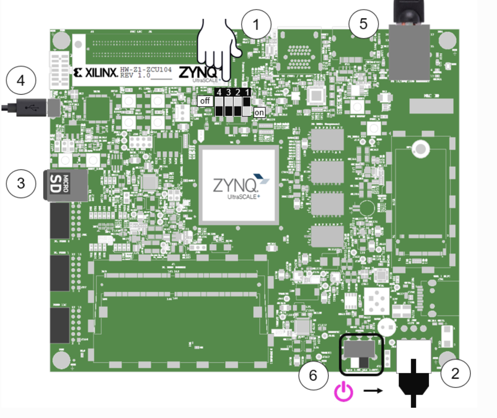

# zcu104 PS端程序烧录运行步骤
本教程旨在将程序运行在zcu104 PS端。
## 运行平台
host：Ubuntu20.04

SDK：Vitis IDE

开发板：Xilinx mp zcu104

# Vitis IDE安装
在Xilinx官网下载2022.2版本的[安装包](https://www.xilinx.com/support/download/index.html/content/xilinx/en/downloadNav/vivado-design-tools.html)。安装之前需要进行一些注册工作，免费的。之后运行安装包程序开始安装。在安装过程中，如果在最后阶段出现了卡住的情况，是因为缺少安装包导致的。自行百度解决，很好解决，只不过方法我忘了。

总共可能需要20G左右的空间。

# 示例代码的烧录过程
[参考教程](https://blog.csdn.net/qq_39229006/article/details/108821786)

烧录工具：[Etcher](https://www.balena.io/etcher)

烧录前不需要进行格式化和分区操作，烧录工具会自动进行上述工作。

# 连接板子串口调试

zcu104自带UART调试接口，使用套件自带的数据线连接板子和host即可。

主机端使用putty连接调试软件。

在开机之前，首先将板子和线连接起来，打开putty，使用Serial界面，/dev/USB01端口。波特率115200.

之后将启动拨码开关拨到下图所示的位置,即1000，将板子启动模式调为SD卡启动模式：

然后插卡开机，待所有灯，尤其是靠近sd卡的那个大灯由红转绿，证明启动成功，此时在putty也可以看到相关的启动过程，然后就可以愉快调试了。