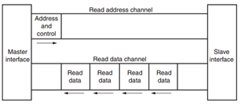
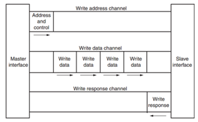

目录
- [概述](#概述)
- [概念](#概念)
  - [MPSoC芯片介绍](#mpsoc芯片介绍)
    - [PS和PL的互联技术](#ps和pl的互联技术)
- [流程](#流程)
  - [MPSoC芯片介绍](#mpsoc芯片介绍-1)
    - [通信流程](#通信流程)
    - [ZYNQ芯片开发流程](#zynq芯片开发流程)

# 概述
本文主要记录FPGA ZYNQ MP的学习过程，包括各种概念、结构图以及遇到的问题等等。

文章的结构主要为：
+ 概念部分：主要是一些名词的定义，解释等
+ 流程部分：主要介绍各个组件是如何组织并工作的
+ 架构部分：主要讲大的架构是如何工作的
+ 示例：如何在板子中开发部署完整的应用

本文主要的依据为[知乎专栏文章](https://zhuanlan.zhihu.com/p/337399826)。同时，在[B站](https://www.bilibili.com/video/BV1dg411E754/?buvid=YE4BF8EEAFD4116C43A3901948B17A0E6CAC&is_story_h5=false&mid=MiaY7RVbUrjA%2FEVK0BoFMQ%3D%3D&p=1&plat_id=114&share_from=ugc&share_medium=iphone&share_plat=ios&share_session_id=8B230E7F-45B6-4E8E-B6A0-28A5E24B9571&share_source=WEIXIN&share_tag=s_i&timestamp=1686054118&unique_k=QthszvV&up_id=473639301)也有相应的应用教程。同时以**Zynq UltraScale+ Device Technical Reference Manual**官方文档为参考。

# 概念

## MPSoC芯片介绍

### PS和PL的互联技术
AMBA®互连：这是ARM架构的总线标准，包括了AXI、AHB、APB等协议。AMBA®互连被用于连接PS和PL之间的通信，也可以用于连接不同的IP核和外设。
+ AXI（Advanced eXtensible Interface）是一种高性能、高带宽的总线接口，用于连接高性能外设和处理器。
+ AHB（Advanced High-performance Bus）是一种高性能、低延迟的总线接口，用于连接低速外设和处理器。
+ APB（Advanced Peripheral Bus）是一种低功耗、低带宽的总线接口，用于连接低功耗外设和处理器。

常用的AXI接口IP：
+ AXI-DMA：实现从PS内存到PL高速传输高速通道AXI-HP<---->AXI-Stream的转换。
+ AXI-FIFO-MM2S：实现从PS内存到PL通用传输通道AXI-HPM<----->AXI-Stream的转换。
+ AXI-Datamover：实现从PS内存到PL高速传输高速通道AXI-HP(High-performance Purpose)<---->AXI-Stream的转换，只不过这次是完全由PL控制的，PS是完全被动的。
+ AXI-VDMA：实现从PS内存到PL高速传输高速通道AXI-HP<---->AXI-Stream的转换，只不过是专门针对视频、图像等二维数据的。
+ AXI-CDMA：这个是由PL完成的将数据从内存的一个位置搬移到另一个位置，无需CPU来插手。

QSPI Flash: 用于访问串行Flash设备。支持AHB和APB两种总线传输协议。

LPD：全称为Low Power Domain。通常用于执行低功耗的应用程序，如传感器数据采集、控制系统、物联网等，可以通过高速总线连接到PS，从而实现与PS之间的数据交换和协同工作。

# 流程

## MPSoC芯片介绍

### 通信流程
首先需要明确：通信是两个设备之间进行指令、地址或者数据传输的过程。发送通信请求的一端称为**主设备（Master Interface）**；接收请求并响应的一端称为**从设备（Stave Interface）**。

当多个外设需要互相交互数据时，我们需要加入一个AXI Interconnect模块，也就是AXI互联矩阵，作用是提供将一个或多个AXI主设备连接到一个或多个AXI从设备的一种交换机制（有点类似于交换机里面的交换矩阵）。

下面我们主要以AXI协议为例讲述整个通信的流程。

AXI协议主要描述了主设备和从设备之间的数据传输方式，主设备和从设备之间通过握手信号建立连接。当从设备准备好接收数据时，会发出**READY**信号。当主设备的数据准备好时，会发出和维持**VALID**信号，表示数据有效。数据只有在**READY**和**VALID**都有效时才会传输。当两个信号有一个被终止的时候，传输终止。

在ZYNQ中，支持AXI-Lite，AXI4和AXI-Stream三种总线，他们的特性和应用场景如下表：

|接口协议|特性|应用场景|
|-|-|-|
|AXI4-Lite|地址/单数据传输|低速外设或控制|
|AXI4|地址/突发数据传输|地址的批量传输|
|AXI4-Stream|仅传输数据，突发传输|数据流和媒体流传输|

其中AXI4-Lite只适合低速，小批量的数据传输，一次只能传输一个字（32bit）；

AXI跟AXI4-Lite差不多，只不过增加了批量传输的功能。可以对一片连续的物理地址进行一次性读写。

AXI4-Stream是一种不需要地址线的连续流接口。由于不需要地址线，所以需要AXI-DMA模块来实现内存地址到流式接口的转换。

AXI4和AXI4-Lite接口包含5个不同的通道：
+ Read Address Channel
+ Write Address Channel
+ Read Data Channel
+ Write Data Channel
+ Write Response Channel
其中每个通道都是一个独立的AXI握手协议。下面两个图分别显示了读和写的模型：

 
AXI读数据通道

 
AXI写数据通道

### ZYNQ芯片开发流程
ZYNQ的开发是先硬件后软件的方法。具体流程如下：

1) 在Vivado上新建工程，增加一个嵌入式的源文件。

2) 在Vivado里添加和配置PS和PL部分基本的外设，或需要添加自定义的外设。

3) 在Vivado里生成顶层HDL文件，并添加约束文件。再编译生成比特流文件（*.bit）。

4) 导出硬件信息到SDK软件开发环境，在SDK环境里可以编写一些调试软件验证硬件和软件，结合比特流文件单独调试ZYNQ系统。

5) 在SDK里生成FSBL文件。

6) 在VMware虚拟机里生成u-boot.elf、 bootloader 镜像。

7) 在SDK里通过FSBL文件, 比特流文件system.bit和u-boot.elf文件生成一个BOOT.bin文件。

8) 在VMware里生成Ubuntu的内核镜像文件Zimage和Ubuntu的根文件系统。另外还需要要对FPGA自定义的IP编写驱动。

9) 把BOOT、内核、设备树、根文件系统文件放入到SD卡中，启动开发板电源，Linux操作系统会从SD卡里启动。

