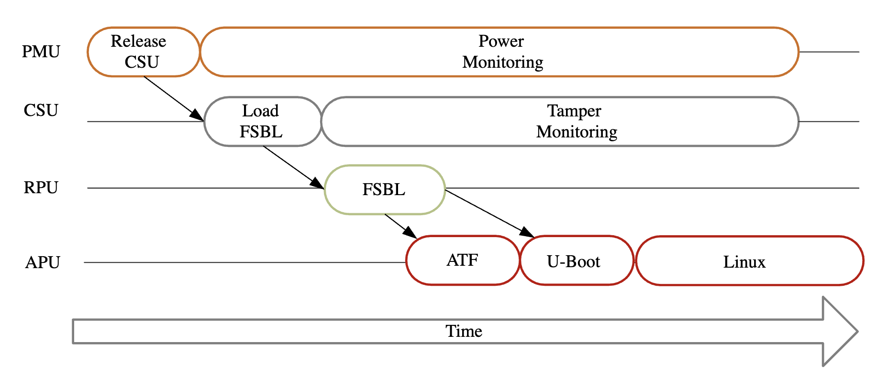
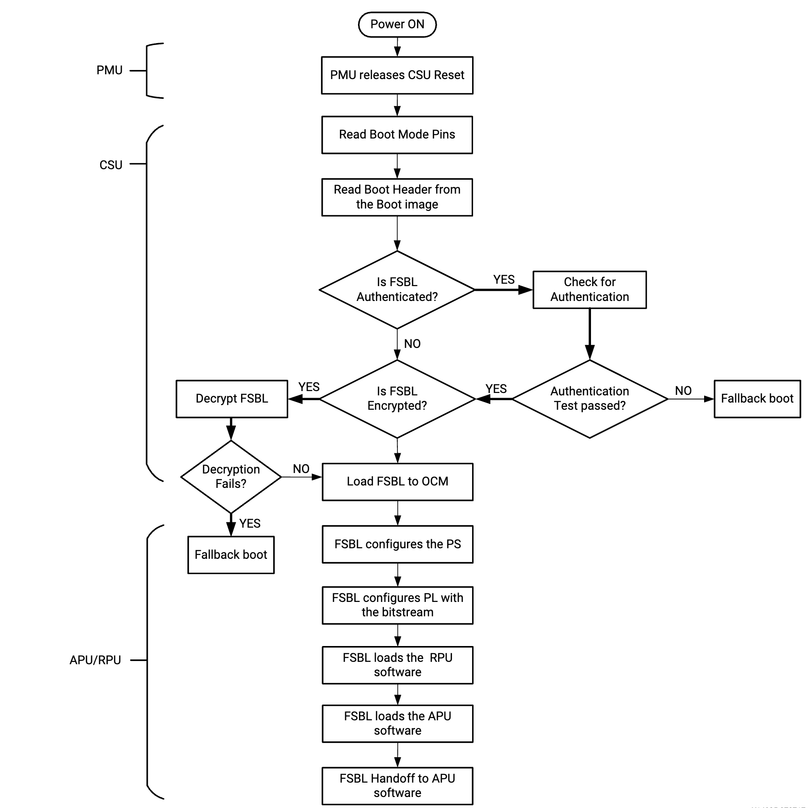

目录
- [启动过程](#启动过程)
- [Xilinx zynqmp安全特性](#xilinx-zynqmp安全特性)
  - [引导过程中的安全措施](#引导过程中的安全措施)
    - [加密](#加密)
    - [认证](#认证)
  - [运行时的安全措施](#运行时的安全措施)
    - [TF-A](#tf-a)
    - [XMPU](#xmpu)
    - [XPPU](#xppu)
    - [系统内存管理单元](#系统内存管理单元)
    - [A53内存管理单元](#a53内存管理单元)
    - [R5内存管理单元](#r5内存管理单元)

# 启动过程
启动过程概述如图所示：

引导步骤解释：
+ 最开始时，由POR（Plantform management unit）将PMU从复位状态带出。PMU主要控制预配置阶段，执行PMU ROM来设置系统，例如为设备配置默认的电源状态，初始化RAM，测试内存和寄存器等，并释放CSU（Configuration Security Unit）复位。
+ 在配置阶段，CSU检查FSBL（First Stage Boot Loader）是否需要认证。若认证检查通过，则继续执行。接着初始化OCM（On Chip Memory），确定启动模式设置，加载FSBL和可选的PMU固件（可以被PMU单元执行的软件）加载到OCM。之后CSU将控制权移交给FSBL。
+ 之后FSBL加载ATF和U-Boot，再由U-Boot加载Linux。

引导流程图如下图所示：


# Xilinx zynqmp安全特性
Xilinx zynqmp提供了一下安全功能来解决应用程序启动时和运行时的安全问题。

而这些安全功能被集成到系统保护单元(SPU)当中。包括：
+ Xilinx 内存保护单元（XMPU）
+ Xilinx 外设（Peripheral）保护单元（XPPU）
+ 系统内存管理单元（SMMU）
+ A53内存管理单元
+ R5内存管理单元

## 引导过程中的安全措施
引导过程中主要是使用加密和身份验证保证安全。
### 加密
zynqmp使用AES-GCM硬件加密引擎来支持启动映像的保密性。也可以在启动后支持数据的加密和解密。

在制作启动映像（BOOT.bin）阶段，将红色密钥（red key）以.nky文件的格式和初始化向量（IV）提供给Bootgen工具来对映像进行加密。其中，red key是用PUF（物理不可克隆函数）密钥加密密钥（KEK）的。设备在使用red key之前需要先进行解密。

**需要注意的是，制作启动映像如果同时需要FSBL和PMU，并且两个文件都需要加密的话，则必须由FSBL加载PMU固件（而不是通过CSU的bootROM加载），以避免重复使用AES Key/IV对。**

示例：
```
该示例的PMU固件即是由FSBL加载
the_ROM_image: { 
    [aeskeyfile] bbram.nky 
    [keysrc_encryption] bbram_red_key 
    [bootloader, encryption=aes, destination_cpu=a53-0] ZynqMP_Fsbl.elf 
    [destination_cpu = pmu, encryption=aes] pmufw.elf 
    }
```
注意到，上述示例使用的是BBRAM（BiasBRAM）red key，也可以使用efuse（一次性可编程存储器）red key。

注意到，red key主要设计底层硬件设备的加密过程，所以称为设备密钥(device key)，为了防止设备密钥的频繁使用而造成的安全风险，可以使用设备密钥的业务密钥（operational key，op key）选项。该选项启用了另外一个密钥称为业务密钥，用于对分区等其他用户自定义需要加密的组件进行加密。

使用的方法为：设备密钥与业务密钥分别存储。设备密钥在对FSBL等引导加载程序进行加密后，返回密文以及业务密钥。之后就可以使用业务密钥加密其他组件以形成完整镜像。

设备密钥的用法以及格式的示例：
```
用法：
bootgen -arch zynqmp -image stage1.bif -o fsbl_e.bin -w on -log error

其中bif文件可以为：
stage1: { 
    [aeskeyfile] aes.nky 
    [fsbl_config] opt_key 
    [keysrc_encryption] bbram_red_key 
    [bootloader,destination_cpu=a53-0, encryption=aes]fsbl.elf 
}
```
```
密钥格式：
Device xc7z020clg484; 
Key 0 AD00C023E238AC9039EA984D49AA8C819456A98C124AE890ACEF002100128932; 
IV 0 F7F8FDE08674A28DC6ED8E37; 
Key Opt 229C993D1310DD27B6713749B6D07FCF8D3DCA01EC9C64778CBAF457D613508F;
```

业务密钥的用法以及格式的示例：
```
用法：
bootgen -arch zynqmp -image stage2a.bif -o final.bin -w on -log error

其中bif文件可以为：
stage2: { 
    [aeskeyfile] aes-opt.nky 
    [bootimage]fsbl_e.bin [destination_cpu=a53-0,encryption=aes]hello.elf 
    [destination_cpu=a53-1,encryption=aes]hello1.elf }
```
```
密钥格式：
Device xc7z020clg484; 
Key 0 229C993D1310DD27B6713749B6D07FCF8D3DCA01EC9C64778CBAF457D613508F; 
IV 0 F7F8FDE08674A28DC6ED8E37;
```
### 认证
身份认证使用非对称密码体制，即私钥用于签名，公钥用于认证。而该体制使用两个级别的密钥：PK（Primary key）和SK（Secondary key）。每个级别的密钥又分别包含公钥PP(S)K和私钥SP(S)K。

认证使用的是SHA-3硬件加速器，该加速器负责实现SHA-3算法并产生384位的摘要（digest）。它与RSA-4096一起被包含在加密接口块（Crypto interface block，CIB）中为image提供认证服务。

其中对于SHA-3，Xilinx使用Keccak SHA3来计算Boot header、PPK哈希以及boot image的哈希值；而使用NIST-SHA3计算所有其他不由ROM加载的分区。

**两种SHA3的区别是填充不同（10\*1 vs 0110\*1）.**

认证的一个bif示例为：
```
the_ROM_image: { 
    [fsbl_config] bh_auth_enable 
    [auth_params] ppk_select=0; spk_id=0x00000000 
    [pskfile] primary_4096.pem 
    [sskfile] secondary_4096.pem 
    [bootloader, authentication=rsa, destination_cpu=a53-0] fsbl.elf 
    [pmufw_image, authentication=rsa] xpfw.elf }
```

## 运行时的安全措施
运行时安全(Run-Time Security)涉及保护系统免受由指令出错或者恶意设备破坏系统内存导致的系统故障。

ZynqMP通过以下模块保证内存和外围设备的安全：
+ Trusted Firmware-A
+ Xilinx 内存保护单元（XMPU）
+ Xilinx 外设（Peripheral）保护单元（XPPU）
+ 系统内存管理单元（SMMU）
+ A53内存管理单元
+ R5内存管理单元

### TF-A
TF-A的主要目的是**确保系统模块（驱动程序、应用程序）与安全资源隔离**。除此之外，TF-A的另一个用途是**防止任何用户空间应用程序直接访问硬件加密引擎**，而改用间接方式。
```
例如，用户程序可以调用内核，将要处理的数据复制到内核空间，之后驱动程序将数据从内核的虚拟地址复制到物理地址。之后，驱动程序调用TF-A，然后调用PMU/CSU对物理地址执行加密操作。
```
TF-A提供的函数[列表](https://docs.xilinx.com/r/en-US/ug1137-zynq-ultrascale-mpsoc-swdev/TF-A-Functions)如下：

|函数名|解释|
|-|-|
|bl31_arch_setup();|EL3通用架构设置|
|bl31_platform_setup();|BL1平台设置|
|bl31_lib_init();|初始化所有BL31辅助库的简单函数|
|cm_init();|上下文管理库的初始化例行程序|
|dcsw_op_all(DCCSW);|在重新进入不安全的世界之前清理缓存|
|(*bl32_init)();|初始化BL32镜像的函数指针|
|runtime_svc_init();|顾名思义，runtime service init。该函数负责调用运行时服务导出描述符中的初始化例行程序。在验证描述符后，将其开始和结束所属实体编号以及调用类型组合起来，形成唯一的标识。该标识符是rt_svc_descs_indices数组的索引。存储运行时服务描述符的索引。（没太懂）|
|validate_rt_svc_desc();|在使用运行时服务描述符之前对其进行完整性检查的简单例行程序。|
|get_unique_oen();|获取唯一标识的程序。|
|bl31_prepare_next_image_entry();|程序EL3寄存器并执行其他设置，以便在下一个ERET的BL31之后进入下一个镜像。|
|bl31_get_next_image_type();|返回下一个镜像的类型。|
|bl31_plat_get_next_image_ep_info (image_type);|返回在指定安全状态下运行的映像所对应的entry_point_info结构的引用。|
|get_security_state ()|获取当前安全状态。|
|cm_init_context()|初始化cpu_context以供当前cpu首次使用，并设置entry_point_info结构指定的初始入口点状态。|
|get_scr_el3_from_routing_model()|返回SCR_EL3的缓存副本，其中包含通过先前对set_routing_mode()的调用存储的安全状态的路由模型（通过IRQ和FIQ位表示）。|
|cm_prepare_el3_exit()|为首次进入安全或非安全软件世界准备CPU系统寄存器。|
|cm_get_context(security_state);|获取安全状态的上下文。|
|el1_sysregs_context_restore|恢复系统寄存器的上下文。|
|cm_set_next_context|处理返回异常的上下文。对于发送请求的安全状态，此函数用于向cpu_context的一个指针初始化SP_EL3。|
|bl31_register_bl32_init|初始化指向BL32 init函数的指针。|
|bl31_set_next_image_type|访问器函数，以帮助运行时服务确定在BL31之后执行哪个镜像。|
### XMPU
**任何安全或功能安全系统的基础是内存的隔离**。XMPU使用户能够对用户定义的内存区域进行分区。

XMPU可以一次性由vivado工具配置，也可以通过安全主节点（PMU、TZ）等进行配置。此外，XMPU的配置是可以锁定的，在锁定之后，只有在下一次上电复位时才能被重新配置。如果未被锁定，则可以通过安全主节点进行动态配置。一个XMPU可以隔离16个内存区域。每个区域在1Mb(DDR)或4kb(OCM)边界上对齐。对每个区域，内存保护靠的是两个检查：
+ 发起请求的事物地址在由START_ADDR和END_ADDR定义的区域内。
+ 允许输入事务的masterID。

上述START_ADDR、END_ADDR以及masterID在系统设置中定义，在XMPU寄存器空间中可读。APU只有一个masterID。

### XPPU
XPPU保护外设、消息缓冲区、处理器间中断（IPI）、通信和Quad SPI闪存。

### 系统内存管理单元
SMMU通过虚拟化I/O和DMA设备的地址空间，为它们提供隔离。SMMU提供设备隔离功能，防止DMA攻击。为了提供隔离和内存保护，它将支持dma的I/O的设备访问限制在预先分配的物理地址中。

### A53内存管理单元
MMU控制访问主内存中的翻译表的表遍历硬件，将虚拟地址转换为物理地址并且提供可配置的1阶或2阶段地址转换。

### R5内存管理单元
通过MPU可以将内存划分为多个区域，并为每个区域设置单独的保护属性，最多支持16个区域。
