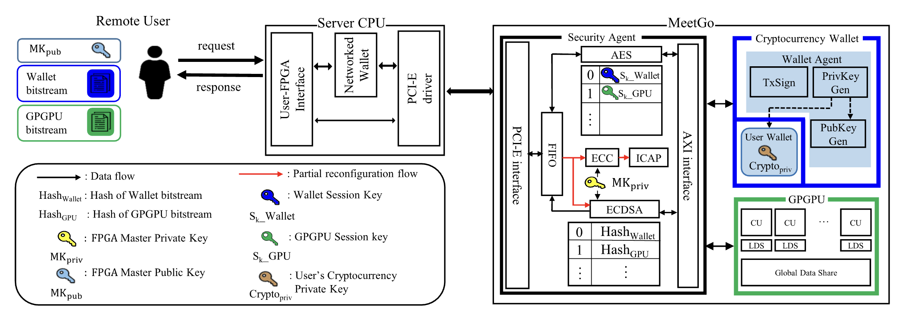

# MeetGo_A_Trusted_Execution_Environment_for_Remote_Applications_on_FPGA

# 背景

用户可以借助远程计算这一技术高效处理大量计算。但是，这些用于计算的远程服务器面临很多攻击。例如，一个黑客获取到了远程服务器的管理员权限，则他可以不受阻碍地任意窃取或者破坏用户的隐私数据；或者，内部管理员试图窃取用户的隐私数据等。

# 本文工作
实现了一个基于FPGA的可信执行环境：MeetGo，它利用了FPGA的可编程性，使用户能够在不受信任的远程服务器上构建自己的TEE，只需在比特流中加载相应的硬件模块，并且可以独立运行而不受主机系统的影响，这意味着用户数据可以安全在其中参与计算而不受恶意管理员的影响。

同时还实现了两个具体的应用程序：加密货币钱包和GPGPU用于测试MeetGo的能力和有效性。

## 具有的能力
+ 安全性高
+ 可伸缩性强，即可以适用于多种场景，并且在资源限制较大的环境中仍能提供安全服务
+ 性能损耗可接受

## 基于的平台
在CPU/FPGA混合架构中借助FPGA实现可信执行环境。

## 具体工作
以下工作都是由健壮的硬件支撑，而不是依赖于软件实现。
### **实现了一种远程认证机制**
可以验证以硬件逻辑形式存在的的应用程序的完整性。
### **实现了隔离机制**
可以阻止恶意CPU对应用程序的未经授权的访问。
### **开发了一种安全通信机制**
允许在已安装的应用程序和远程用户之间安全传输敏感数据。
### **可以与其他TEE一同协作**
允许SGX以用户的形式与MeetGo进行通信。

# 威胁模型
## 可信的
+ MeetGo的内置模块
+ FPGA没有硬件后门或木马

## 不可信的
+ 负责管理的恶意内部人员
+ 外部的攻击者，可以完全掌握CPU的控制权

## 攻击手段
+ 欺骗TEE的身份验证过程或在FPGA内部安装恶意模块来破坏TEE的隔离属性
+ 各种物理和侧信道攻击，窃听或干扰用户和TEE之间的通信

# 架构细节
MeetGo的信任根是一个成为主密钥(MKpriv)的私钥嵌入在FPGA中，MKpriv可以防篡改。

除了MKpriv，MeetGo还包含一个安全代理（Security Agent，SA）。

## MKpriv
MKpriv本身是一种非对称密钥算法，它的先决条件是每一个FPGA都有一个唯一的私钥MKpriv，并且允许FPGA通过匹配的公钥MKpub进行识别。

MKpriv有两种保存方式：

+ 将MKpriv存储在SA中
  + 在这种方法中，FPGA制造商将生成的MKpriv植入到SA代码中（即位流，bitstream）。
  + 位流是通过安全位流加载机制以加密形式分布和安装的，因此是安全的。
  + 需要一对一地将FPGA和拥有每个MKpriv的SA比特流强绑定，这种绑定可以通过FPGA制造商为每对FPGA和SA比特流来构建，该密钥是安全比特流加载机制中使用不同的密钥。
+ 将MKpriv存储在非易失性存储器(NON-VOLATILE MEMORY)中
  + 该方法将MKpriv进行加密，将秘文存储在FPGA的eFUSE或PROM等非易失性存储器中。
  + 将用于解密的密钥存储在SA的位流中。

本文选择了第一种存储方法。

## 安全代理
安全代理提供了以下核心安全功能：
+ **远程认证** 使用户能够评估其在FPGA中运行的应用程序的真实性和完整性。
+ **隔离** 防止不可信主机和运行私有状态的应用程序之间未经授权的访问。
+ **远程用户与FPGA之间的安全连接** 

### 安全代理的加载过程
安全代理可以通过商用FPGA上提供的安全比特流加载机制来实现。该机制支持上电后自动加载加密后存储在存储介质中的比特流。

当FPGA启动时，只有基础架构的硬件可以解密并安装安全代理。此外，MeetGo允许远程用户检查TEE是否被激活来防止TEE被干扰而未激活的问题。

## 加载TEE应用
为了在FPGA上动态加载和运行应用程序，一个被称作**部分重新配置**的特性被应用。该特性允许在FPGA运行时通过下载的部分位流来修改FPGA的一个子集。

注意，加载完成的应用程序不与其他应用程序共享任何资源，以避免在资源共享下产生的安全问题。每个应用程序只是用其分配区域的资源，只与SA通信。

在一开始的时候，SA被加载到静态区域，应用程序可以在必要时作为部分位流加载到动态区域，允许运行时重新编程。

此时动态区域再次划分为几个区域，每个区域中都安装了一个单独的应用程序。分区在启动时根据SA位流中预定义的配置(即区域的数量和大小)进行组织。分区配置一次后就固定了，区域的独占访问权限只授予SA，后续加载应用程序的过程完全由SA控制。

## 用户交互完整流程
+ 用户使用MKpub对数据进行加密，用户可以选用特定的MKpub来指定一个特定的FPGA进行计算。
+ 目标FPGA接收到用户发来的密文。
+ SA验证密文签名，以确保其通过可信第三方认证并且没有被非法修改。
+ SA用MKpriv解密密文，并将解密出来的比特流安装在动态区域的一个区域上。
+ 计算并生成比特流的签名
+ 加载应用程序完毕后，SA发送消息通知远程用户应用程序的ID，以及表示消息完整性和真实性的签名。

## 远程认证服务
MeetGo允许用户随时验证在FPGA上运行的应用程序的真实性和完整性。

SA采用静态认证方案。即SA会计算应用程序的hash并将其与应用程序的ID一起存储。当用户想要验证时，会发送一条请求消息，包含目标应用程序的ID和一个随机序列（以防重放攻击）。接收到消息后，SA会将应用程序的hash值和随机序列，并根据上述消息生成一个签名一并发送给远程用户。远程用户通过以下步骤验证：
+ 检查随机序列的正确性
+ 将发送过来的hash值与目标应用程序关联的已知值进行比较
+ 通过MKpub验证签名

## 在用户和FPGA之间建立安全信道
两端通过对称会话密钥对信息加密的方式进行安全通信，密钥交换步骤如下：
+ 用户生成会话密钥Sk，然后使用目标应用程序所在FPGA的MKpub加密，一个随机的序列和应用程序ID也包括在一起并加密。
+ SA收到加密报文后，使用MKpriv对报文进行解密，获得Sk。
+ SA通过管理Sk与应用ID的一一对应表，防止多个用户同时访问同一个应用。
+ 然后返回确认，其中包括发送的序列和使用MKpriv生成的签名。
+ 最后，通过使用MKpub验证签名，远程用户可以确保会话已被打开，相关的Sk已安全地共享给SA。

对称会话密钥算法：AES(带有Galois/Counter模式)

用户和SA之间共享的Sk在用户关闭已建立的会话或预定义的会话超时之前有效。

## 结构
MeetGo结构如下图所示：

如图所示，SA由几个内部模块组成，每个模块用于独立的操作。首先，**椭圆曲线加密(ECC)**和**AES**的两个模块分别使用MKpriv和Sk参与加密和解密过程。然后，**椭圆曲线数字签名算法(ECDSA)模块**使用MKpriv生成并验证签名。然后**ICAP模块**和加密模块一同加载部分比特流到FPGA上。这些应用的比特流在ECDSA中验证，在ECC中解密，在FPGA上通过ICAP进行配置。最后，在通信方面使用了以下两个模块:**PCIe接口模块**用于与主机通信，**AXI接口模块**起着连接SA和FPGA内部应用程序的作用。

