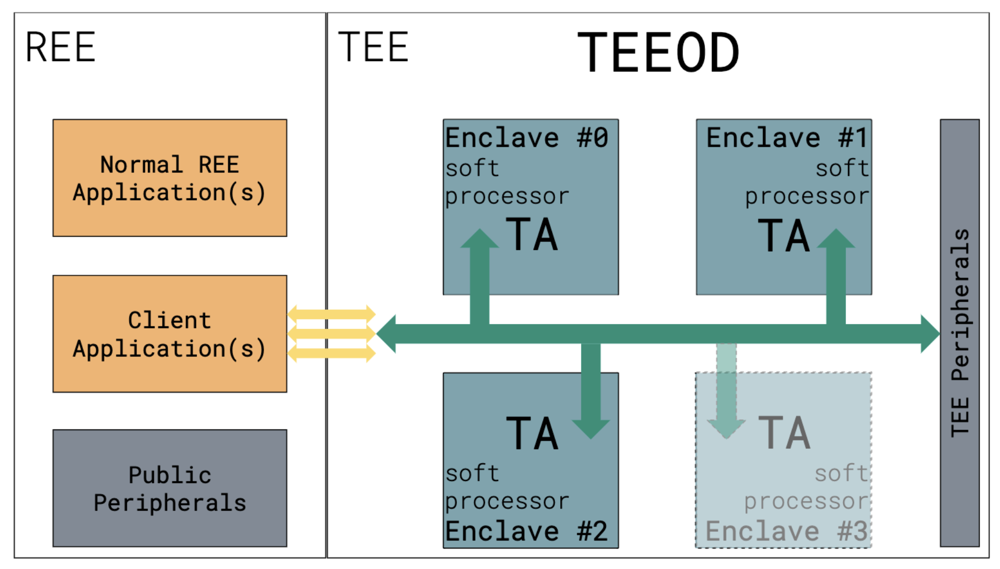
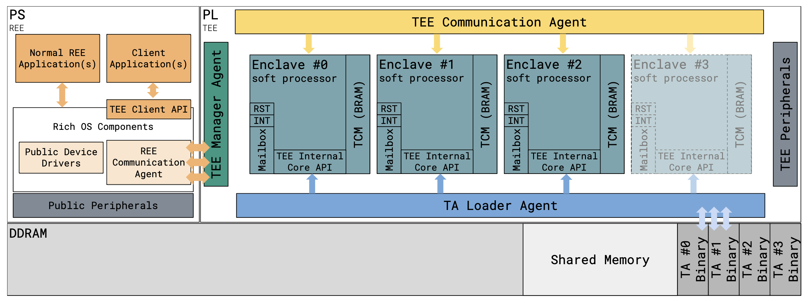

# Towards a Trusted Execution Environment via Reconfigurable FPGA

# 概述
以往的可信执行环境中的安全元素被滥用，这本身降低了其安全性。因此本文提出了一种**按需可信执行环境(Trusted Execution Environment On-Demand, TEEOD)**。该TEE可以提供高带宽连接和物理片上隔离。

## 现有TEE的弱点
### TZ和SGX
两者都是在主处理器上虚拟出安全处理器，但会面临很多攻击。

### 谷歌的Titan和苹果的T2
在CPU旁安装专用处理器。片外通信结构会暴露，导致其容易遭受探测攻击。此外，该处理器与主处理器之间的通信带宽很低，限制了性能。

# 本文工作
提出了TEEOD。利用可重构的FPGA技术，使用可编程逻辑（PL）为每个应用程序定制专用的安全处理器。这样一个处理器只为一个应用程序服务,就不会出现安全特性的滥用，从而提高了安全性。

同时为了测试实用性，本文还在其中部署了一个开源比特币钱包，并且对硬件成本和性能进行了评估。

## 威胁模型

+ 攻击者可以控制REE和TEE组件的接口
+ TZ中的TA是不可信任的，可能会对其他TA产生安全威胁
+ 攻击者可以访问总线，并可以重新配置FPGA硬件

## 工作目标
+ 将安全应用与REE隔离
+ 安全应用之间相互隔离
+ 只实例化并且允许修改来自预先批准的可信源TA
+ 实现数据的识别和绑定，从而防止恶意访问
+ 数据的安全存储
+ 需要提供安全配对设备和TA的能力
+ 使用先进的密码算法

## 设计原则
+ 避免资源的共享
  + 防止安全软硬件资源被滥用而导致的安全问题的出现
+ 采用最小特权原则
  + 赋予每个TA尽量小的特权来防止其恶意行为的出现

## 创新点
+ 实现了FPGA上的可信执行环境
+ 使用可编程逻辑实现了安全处理器，进而实现了处理器之间的隔离

# 架构细节

架构细节如上图所示。可以看到，TEEOD使用软处理器作为TA安全执行的enclave。
## 生命周期
### 1. enclave创建
TEEOD保存两个列表：可用的enclave列表和已经加载的TA列表。

当REE请求安全服务时，它需要调用TEEOD给出的`TEE client API`，并且给出想要通信的信息，除此之外，该API还保存有TA的UUID以及其在连续物理内存(CM)上的位置。

当TA没有加载到enclave时，TEEOD将目标TA的二进制文件复制到可用的enclave私有紧密耦合内存(TCM)中。

之后，TA进入等待中断(wait for interrupt, WFI)状态，直到REE程序发送通信请求。

### 2. enclave执行
+ REE将想要通信的内容发送给TEEOD
+ TEEOD将通过中断向目标enclave发送信号，告诉新消息已经抵达
+ TA从共享内存中读取消息并执行REE请求的命令
+ TA处理命令，并通过清除共享寄存器通知TEEOD其已经完成了请求的命令
+ TA回到等待中断状态

### 3. enclave释放
会话完成后，REE会调用TEE client API提供的关闭会话函数。

TEEOD清除enclave的内存区域，强制重置软处理器并清理其微架构状态，在enclave列表上标记该enclave为可用。从加载的enclave中删除UUID避免泄露。

## REE与TEEOD之间、TEEOD与REE之间的通信
REE使用通信代理模块向TEEOD传递一下信息：
+ 目标TA的UUID
+ 以两者之间共享寄存器的形式传递的请求消息
+ 消息的类型
+ TA对消息的访问权限

之后，TEEOD会对上述信息进行验证，若通过，则通过TEEOD和TA之间的共享寄存器将详细发送给TA并且触发对应的enclave的WTF。

当TA完成请求的服务时，总是回复其操作是否成功，消息在同一个寄存器中进行传递。

## 共享内存管理
是TEE和REE之间的用于数据交换的内存区域。由REE CA管理。

# 概念实现
两个部分：硬件实现和软件API的实现。

## 硬件实现
PoC实现利用异构多处理（PS+PL）的体系结构。PS（Processing system）上主要运行REE系统，PL（Programming Logic）上主要运行TEEOD。硬件架构图如下所示：

可以看到，主要的硬件块是TEE Manager Agent IP，TA Loader IP以及TEE Communication Agent IP，这些用于构建enclave，然后BRAMs用于构成软处理器。

### TEE Manager Agent IP
该IP负责控制TA加载代理IP和TEE通信代理IP的执行。具体的任务是负责enclave的创建和销毁，以及每个TA的正确执行。该IP由两个列表：enclave列表以及已加载的TA列表。

### TA Loader Agent IP
负责将TA的二进制文件加载到enclave的私有内存中。在接收到TEE Manager Agent IP的请求之后，TA Loader Agent IP触发高带宽的定向内存访问(directed memory access, DMA)，将TA从DDRAM加载到目标enclave私有的内存中。

### TEE Communication Agent IP（通信代理IP）
该IP负责启用TEE和REE之间的通信。它为每一个enclave创建一个其他enclave不能访问的消息框。消息框由以下寄存器组成：
+ 操作id，用于识别操作是打开、关闭还是调用
+ 会话id，用于识别正在调用的会话
+ 参数类型，用于确定接下来的8个通用寄存器的类型
+ gp_params,通用寄存器，取决于参数类型是共享内存地址或是原始数据
+ cmd_id，用于指示所需命令的通用寄存器，仅用于调用命令操作

### enclave
enclave是围绕专用轻量级软处理器构建的独立模块，其私有的bram保存有TA代码、收发REE信息的消息框、共享内存空间以及两个中断：复位（reset）中断和TEE通信中断。其中：
+ 复位中断连接到TEE Manager Agent IP
+ TEE通信中断连接到TEE Communication Agent

## TEE Client API
TEE客户端API描述并定义了在REE中运行的客户端应该如何与在TEE中运行的TA通信。

为了识别要使用的YA，客户端需要提供TA的UUID。TEE Client API包含以下API：
+ `TEEC_OpenSession`:在CA和指定TA之间打开一个新的会话，并且与TEE Communication IP通信操作id，当返回TEEC_SUCCESS时，说明该IP已经向会话id寄存器写入了一个id
+ `TEEC_InvokeCommand`：在指定的会话中调用命令
+ `TEEC_CloseSession`：关闭会话，清除会话id寄存器中的内容

## TEE Internal Core API
内部核心API是向在安全区域中运行的TAs公开的API。TEE内部核心API由四个主要部分组成：
+ 数据和密钥的可信存储API
+ 密码操作API
+ 时间API
+ 算数API

# 实用性证明：开源比特币钱包实现
钱包的实现依靠TEE内部核心API特性：
+ 用于创建随机种子短语的随机数生成
+ 用于保存主密钥的安全存储
+ 用于签署链交易和执行其他加密相关操作的加密元语

## 具体实现

# 评估

