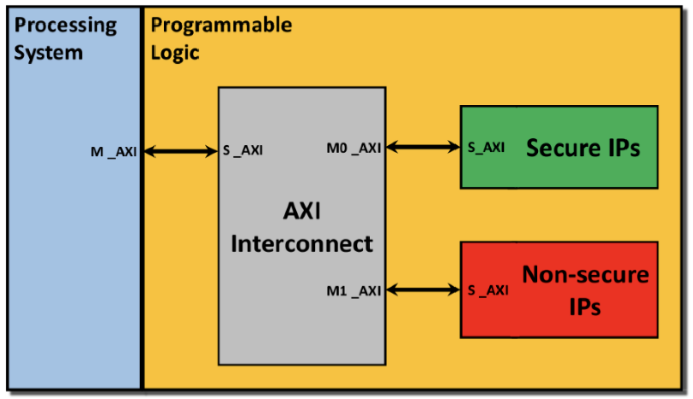

- [概述](#概述)
  - [想法诞生：TZ初步学习以及QEMU模拟](#想法诞生tz初步学习以及qemu模拟)
  - [初上设备：树莓派](#初上设备树莓派)
  - [新的方向：ZYNQ MP SOC](#新的方向zynq-mp-soc)
- [新的研究想法](#新的研究想法)
  - [初步的想法](#初步的想法)
  - [未来的研究步骤](#未来的研究步骤)
- [问题](#问题)
  - [概念问题](#概念问题)
  - [原理问题](#原理问题)
  - [流程问题](#流程问题)

# 概述
TZ作为系统安全实验室新开发的方向，从开始到现在一直不是很顺利。从一开始的QEMU，到树莓派再到FPGA，路线一换再换，方向一改再改。如此波折，一来是因为方向很新，并且还没有成为热门，网上相关的资料不多、不够成熟；二来是我们整个实验室都没有这方面的经验，属于是赶鸭子上架。

现在就是一个骑驴找马的状态，觉得这个方向能做，那就先做着，等到方向逐渐明确了，就微调一下方向，最终要做一个通用的、能够发挥有效作用的安全操作系统。

## 想法诞生：TZ初步学习以及QEMU模拟
## 初上设备：树莓派
## 新的方向：ZYNQ MP SOC

# 新的研究想法
## 初步的想法
ZYNQ MP SOC集成PS和PL端，PS端是基于ARM架构的处理器。在其中，可以运行TZ相应的服务，例如SMC。

在传统的TZ架构中，安全世界和非安全世界中运行的分别是安全和非安全的APP，而我们的想法是将APP替换成安全和非安全的IP，它们之间的隔离同样是靠AXI上的NS位来实现的。

一个简单的架构图如下：

可以看到，PS端可以将一些控制信息通过AXI互联机制发送给不同的IP，并且使用NS位来标记该控制信息是否合法。

## 未来的研究步骤
+ 首先需要学习PS端如何与PL端的IP进行通信，即ZYNQ MP运行的完整流程是怎样的。资料有待补充
+ 学习ATF的运行机制以及如何适配到PS端。参考资料：[ATF源码学习](https://so.csdn.net/so/search?q=ATF%E5%8E%9F%E7%94%9F%E7%AF%87&t=blog&u=weixin_45264425)、[ATF官方文档](https://trustedfirmware-a.readthedocs.io/en/latest/)
+ 将ATF移植到PS端。
+ 在其上构建BL3也就是安全的TEE或者安全的IP和非安全的IP。非安全的ip可以自己去做，安全的ip则可以提供一些安全服务例如加密、认证等。

# 问题
## 概念问题
1F：第一个FTZ结构图中，AXI接口上的M_AXI和S_AXI分别是什么意思？它们之间有什么区别？

1A：M_AXI和S_AXI的全称分别是Master_AXI和Slave_AXI，即**主AXI**和**从AXI**。在读取数据时，主AXI需要先发送读取的地址给从AXI，后者根据地址返回数据；在写入数据时，主AXI需要先发送要写入的地址给从AXI，然后将数据发送给从AXI，后者在写入完成后返回一个response给主AXI。
## 原理问题
## 流程问题