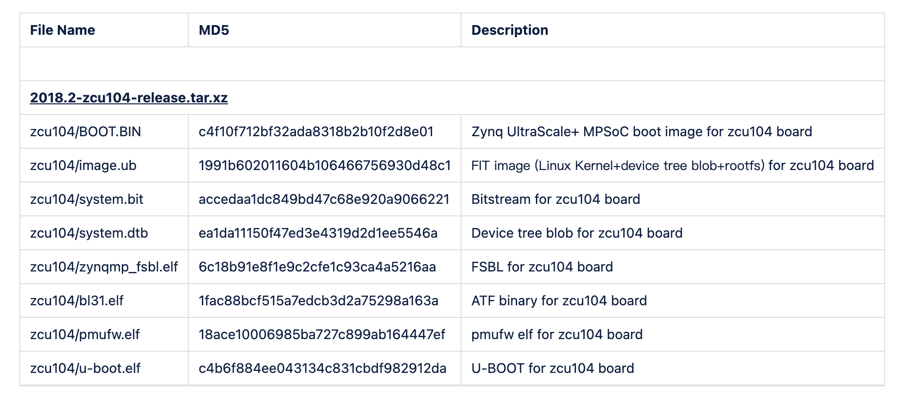

# ZYNQ MP zcu104开发板安装OPTEE步骤

本教程旨在将OPTEE安装在zcu104开发板PS端。步骤分为两步：生成映像文件和烧录开机。

使用的OPTEE版本为3.15.0和latest(3.21.0)，两者的构建方式也不同，3.15.0版本可以使用benchmark工具。

# 生成映像文件
3.15.0版本与3.21.0版本的OP-TEE目录结构略有不同，因此需要分别介绍。
## 3.15.0
这个版本的OPTEE只支持zcu102开发板，因此需要修改的东西比较多。并且，在进行编译时，需要用到的文件也与3.21.0不一样。
### 需要的文件
[2018.2-zcu104.bsp(点击链接直接下载)](https://www.xilinx.com/member/forms/download/xef.html?filename=xilinx-zcu104-v2018.2-final.bsp)

[2018.2-zcu104-release.tar.xz(点击链接直接下载)](https://www.xilinx.com/member/forms/download/xef.html?filename=2018.2-zcu104-release.tar.xz)

下载完成后，将两个文件放到与build同一级文件夹下，解压第二个文件夹后会得到以下文件：

其中，我们要用到bl31.elf、pmufw.elf和zynqmp_fsbl.elf这三个文件，用于生成最后的image.ub和BOOT.bin。

### 改动makefile
当我们开始编译整个项目时，需要运行：
```
make -f zynqmp.mk PLATFORM=zynqmp-zcu104 all
``` 
其中zynqmp.mk是执行编译命令的文件，其中包含了各个文件的编译命令，包括uboot，linux-kernel，atf，image等等。

官方默认编译过程是不包含image的，因此想要编译出image.ub和BOOT.bin，需要修改此文件，具体改动为：
``` python
11 PLATFORM = zynqmp-zcu104  #平台改为zcu104

28 all: tfa optee-os u-boot linux dtbo buildroot image  #增加image命令，开始编译

29 clean: tfa-clean optee-os-clean u-boot-clean linux-clean dtbo-clean buildroot-clean image-clean #相应的，当执行make clean命令时，额外清除image

121 BR2_PACKAGE_OPTEE_CLIENT=y
122 BR2_PACKAGE_OPTEE_TEST=y
123 BR2_PACKAGE_OPTEE_EXAMPLES=y
124 BR2_PACKAGE_OPTEE_BENCHMARK=y

136 FIRMWARE_TARBALL = $(subst zynqmp-,2018.2-,$(PLATFORM))-release.tar.xz  #将资源定位到之前下载的文件上

168 rm -rf ../zcu104-release  #102改为104
```

同时要修改`build/zynqmp`文件夹下的后缀是its的文件，将[此文件](https://github.com/OP-TEE/build/blob/master/zynqmp/fitImage-zynqmp-zcu104.its)的内容将覆盖到这个文件中，并且将文件名中的102改成104。

同理，将[此文件](https://github.com/OP-TEE/build/blob/master/zynqmp/bootImage-zynqmp-zcu104.bif)中的内容覆盖到同一文件夹下的bif后缀的文件中，并改名将102改成104。同时，将文件中的内容改为：
```python
3 [pmufw_image] ../2018.2-zcu104-release/pmufw.elf

4 [bootloader, destination_cpu = a53-0] ../2018.2-zcu104-release/zynqmp_fsbl.elf
```

自此，即可进入`build`文件夹执行编译命令：
```
make -f zynqmp.mk all
```
之后在`build/zynqmp`文件夹下可以得到BOOT.bin和image.ub两个文件。注意要安装petalinux。

## 3.21.0(latest)
与3.15.0差距不大，但是还是有一点区别的。

### 需要的文件
[2022.2-zcu104.bsp(点击链接直接下载)](https://www.xilinx.com/member/forms/download/xef.html?filename=xilinx-zcu104-v2022.2-10141622.bsp)

[2022.2-zcu104-release.tar.xz(点击链接直接下载)](https://www.xilinx.com/member/forms/download/xef.html?filename=2022.2_zcu104_release.tar.xz)

其他的与前述一致。

### 改动makefile

zynqmp.mk需要额外改动的有：
```python
141 FIRMWARE_TARBALL = $(subst zynqmp-,2022.2_,$(PLATFORM))_release.tar.xz
```
不过不需要改动its文件了，bif文件需要将文件路径导为上述下载的第二个文件的位置。目的就是为了能够找到elf文件。
