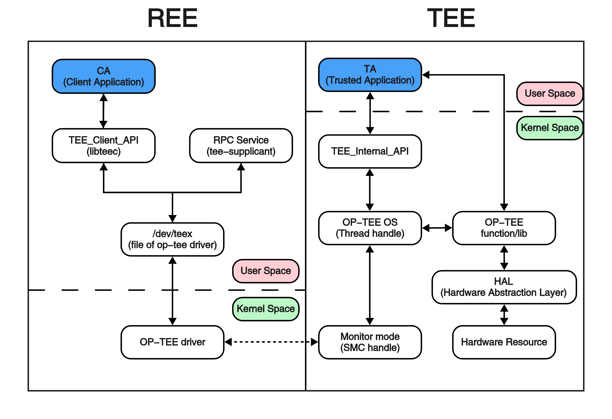
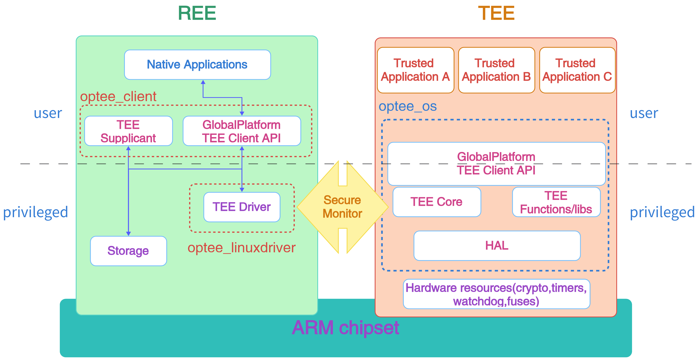

<font size="5">目录</font>
- [文件结构](#文件结构)
- [TA编译过程](#ta编译过程)
  - [编译TA所需要的文件](#编译ta所需要的文件)
  - [make file编写基础](#make-file编写基础)
    - [ta\_dev\_kit.mk](#ta_dev_kitmk)
    - [Makefile编写](#makefile编写)
    - [sub.mk编写](#submk编写)
  - [TA入口实现](#ta入口实现)
  - [TA 属性](#ta-属性)
    - [例子](#例子)
  - [TA的签名](#ta的签名)
- [完整地使用OPTEE安全服务](#完整地使用optee安全服务)
  - [CA与TA的关系](#ca与ta的关系)
  - [整体流程](#整体流程)
  - [安全服务完整流程](#安全服务完整流程)
    - [各层面关系](#各层面关系)
    - [userspace到kernelspace](#userspace到kernelspace)
    - [TEE driver到monitor态](#tee-driver到monitor态)
    - [TEE kernel space到TEE userspace](#tee-kernel-space到tee-userspace)

# 文件结构
| 根目录文件夹 | 简介 |
| -- | -- |
| bin | 存放一些系统调用程序，例如`mkdir` |
| etc | 系统配置文件目录 |
| mnt | 作为挂载点使用 |
| root | 空，超级用户的文件夹 |
| sys | 存放系统配置文件 |
| var | 存放日志缓存 |
| data | 存放数据 |
| opt | 存放第三方应用软件包 |
| run | 存放了一些进程的pid文件 | 
| tmp | 存放临时文件，所有用户对此都有读写权限 |
| dev | 存放硬件设备信息的目录 |
| lib | 存放根文件系统目录下程序和核心模块的共享库 |
| media | 挂载多媒体设备 |
| proc | 系统内存的映射，可以直接访问这个目录来获取系统信息 |
| sbin | 存放系统管理员使用的系统管理程序 |
| usr | 用户目录 |
# TA编译过程
要想在OPTEE中运行受信任的应用(Trusted Application, TA)，就必须符合OPTEE应用编译要求。以下介绍TA的编译过程。
## 编译TA所需要的文件
TA编译以及运行过程中所需要的资源依赖于编译OPTEE-OS过程中生成的TA-devkit(TA开发工具包)。而TA-devkit要求每一个TA提供：

+ Makefile：一个make文件，用于配置编译时的变量，例如库文件调用等，并包括TA-devkit make文件。
+ sub.mk：一个make文件，在其中需要列出要编译的源文件（包括本地源文件、要解析的子目录、源文件特定的编译指令）。
+ user_ta_header_defines.h：一个ANSI-C头文件，用于定义大多数TA的属性。并且在其中需要提供至少一对TA入口的实现，作为extern函数，TA-devkit提供的接口有`TA_CreateEntryPoint()`,`TA_DestoryEntryPoint()`,`TA_OpenSessionEntryPoint()`,`TA_CloseSessionEntry Point()`,`TA_InvokeCommandEntryPoint()`

完整的结构如下：

>
  ```python  
  + hello_world/                   # 工程目录
    + .../                         # 其他文件夹
    + ta/                          # TA
      + Makefile                   # 必需
      + Android.mk                 # 安卓应用可以通过调用此文件启动服务
      + sub.mk                     # 必需
      + include/                   # 存放库文件
        + hello_world_ta.h         # 所需的库文件
      + hello_world_ta.c           # TA源文件
      + user_ta_header_defines.h   # 必需
  ```
## make file编写基础
### ta_dev_kit.mk
它是用来指示TA-devkit进行资源调用的文件。它的位置在
`opteeProject/optee_os/ta/mk/ta_dev_kit.mk`。这个make文件支持编译TA或者清理编译的对象。因此可以被TA中的Makefile调用。

调用该make文件需要配置几个变量：

+ TA_DEV_KIT_DIR：TA-devkit的基本目录，用于TA-devkit定位自带工具。
+ BINARY 和 LIBNAME：显然这是两个名字，并且这两个名字各有用处。
  + 当一个TA被编译之后，则TA-devkit将其编译并签名的二进制文件命名为`${BINARY}.ta`，在原生OPTEE中，BINARY通常被用作TA的UUID，被请求服务者用来标识TA。
  + 当我们正在编译静态库时，则需要用LIBNAME来命名，例如`lib${LIBNAME}.a`
+ CROSS_COMPILE和CROSS_COMPILE32：交叉编译器。`CROSS_COMPILE32`是可选的，它允许载AArch64位机器上编译AArch32 TA程序。在AArch32位系统上默认是`CROSS_COMPILE`。

除了上述必需配置的变量之外，还有很多可选的配置变量，详情看`opteeProject/optee_os/ta/mk/ta_dev_kit.mk`

### Makefile编写
前文说过，Makefile可以引用`ta_dev_kit.mk`，因此在为一个TA编写Makefile时，典型的写法如下：
```python
# TA的UUID
BINARY=1234abcd-1234-abcd-1234-0123456789ab

# 标记出ta_dev_kit.mk的位置
include $(TA_DEV_KIT_DIR)/mk/ta_dev_kit.mk
```
### sub.mk编写
sub.mk需要列出要编译的源文件和其他指定编译指令的入口点。示例如下：

```python
# Adds /hello_world_ta.c from current directory to the list of the source
# 需要编译的文件位置。
srcs-y += hello_world_ta.c

# 标记出include的路径。
global-incdirs-y += include/

# 在文件hello_world_ta.c中添加指令-Wno-strict-prototypes（该指令用于显示第三方警告）
cflags-hello_world_ta.c-y += -Wno-strict-prototypes

# 在文件hello_world_ta.c中删除指令-Wno-strict-prototypes
cflags-remove-hello_world_ta.c-y += -Wno-strict-prototypes

# 添加静态库文件 foo 到链接器指令 -lfoo 的列表中。
libnames += foo

# 将目录路径添加到库路径列表中
libdirs += path/to/libfoo/install/directory

# 将静态二进制库文件添加到TA编译依赖中。
libdeps += path/to/greatlib/libgreatlib.a
```

## TA入口实现
在实现一个TA时，该TA需要提供至少一对强制性的入口点。

```C++
TEE_Result TA_CreateEntryPoint(void)
{
    /* 进行一些初始化工作 ... */
    ...

    /* 返回初始化状态 */
    return TEE_SUCCESS;
}

void TA_DestroyEntryPoint(void)
{
    /* 在TA退出之前释放资源 */
    ...
}

TEE_Result TA_OpenSessionEntryPoint(uint32_t ptype,
                                    TEE_Param param[4],
                                    void **session_id_ptr)
{
    /* 验证客户端的身份，通过后分配或初始化一些会话资源 */
    ...

    /* 返回工作状态 */
    return TEE_SUCCESS;
}

void TA_CloseSessionEntryPoint(void *sess_ptr)
{
    /* 验证客户端身份，通过后释放会话资源 */
    ...
}

TEE_Result TA_InvokeCommandEntryPoint(void *session_id,
                                      uint32_t command_id,
                                      uint32_t parameters_type,
                                      TEE_Param parameters[4])
{
    /* 解码目标服务的命令和要执行的程序 */
    ...

    /* 返回工作状态 */
    return TEE_SUCCESS;
}
```

## TA 属性
TA的属性应该定义在文件`user_ta_header_defines.h`中。其中应该包含：

+ TA_UUID:包含了TA的UUID值
+ TA_FLAGS:包含了TA的一些属性
+ TA_STACK_SIZE:为TA堆栈保留的RAM大小
+ TA_DATA_SIZE:为TA堆保留的RAM大小（`TEE_Malloc()`池）
### 例子
```C++
#ifndef USER_TA_HEADER_DEFINES_H
#define USER_TA_HEADER_DEFINES_H

#define TA_UUID
    { 0x8aaaf200, 0x2450, 0x11e4, \
        { 0xab, 0xe2, 0x00, 0x02, 0xa5, 0xd5, 0xc5, 0x1b} }

#define TA_FLAGS                    (TA_FLAG_EXEC_DDR | \
                        TA_FLAG_SINGLE_INSTANCE | \
                        TA_FLAG_MULTI_SESSION)
#define TA_STACK_SIZE                       (2 * 1024)
#define TA_DATA_SIZE                        (32 * 1024)

#define TA_CURRENT_TA_EXT_PROPERTIES \
    { "gp.ta.description", USER_TA_PROP_TYPE_STRING, "Foo TA for some purpose." }, \
    { "gp.ta.version", USER_TA_PROP_TYPE_U32, &(const uint32_t){ 0x0100 } }

#endif /* USER_TA_HEADER_DEFINES_H */
```
## TA的签名
所有来自REE文件系统的客户端都需要签名。在请求TA服务时由OPTEE-OS验证签名合法性。

用于签名的密钥在OPTEE-OS源代码的`keys`文件夹中。需要注意的是，不能在生产环境中使用这个密钥的私钥签名optee_os二进制文件，应该用公钥进行签名，并且将私钥离线保存。在进行离线脱机签名时，就需要用私钥进行签名了。[离线签名详情](https://optee.readthedocs.io/en/latest/building/trusted_applications.html#offline-signing-of-tas)

签名过程：TA调用`sign_encrypt.py`脚本进行签名，具体方式是调用optee_os中的`ta/mk/ta_dev_kit.mk`脚本。该py脚本默认对编译后的TA二进制文件进行签名，并且将签名附加在二进制文件后面，从而形成一个完整的TA。

目前OPTEE-OS仅支持一个单独的密钥来对TA进行签名。


# 完整地使用OPTEE安全服务
众所周知，TrustZone将安全的服务放到TEE端，将非安全服务放到REE端，中间使用Monitor进行交流控制。因此，REE端要想使用TEE端的安全服务，就必须调用相应的指令来请求服务，例如使用何种算法来对数据进行安全处理等。这就需要在两端分别开发一个程序来进行交流，在REE端的程序称为CA程序，在TEE端的程序称为TA程序。
## CA与TA的关系
先来看CA与TA之间执行的软件图：


可以看到，无论是TA还是CA，都是在`User Space`层，只是一个在REE端，一个在TEE端。

当我们想借助TA实现安全服务时，使用CA发起功能调用，具体功能实现则交由TA完成，TA完成后将结果源路返回到CA。而所有的交流都需要经过OP-TEE的client端接口，OP-TEE在Linux kernel端的驱动，Mointor模式下的SMC处理，OP-TEE OS的thread处理，OP-TEE中的TA程序运行，OP-TEE端底层库或者硬件资源支持等几个阶段。

## 整体流程
现在已经知道，一个安全服务的使用是靠CA发起服务请求，之后对应的TA处理请求，再将结果原路返回到CA。因此需要了解CA是如何发起服务请求以及TA如何接收、处理数据以及返回结果的。
## 安全服务完整流程
原生的OPTEE OS并不带TA，因此就需要二级厂商例如华为自己添加TA和CA的接口。当上层APP调用CA服务时，一般需要二级厂商建立相应的client，client通过Binder的方式实现CA接口调用的操作。同时，client还会提供接口以JNI方式进行封装暴露给上层APP使用。
### 各层面关系
首先看支持TEE的系统各层面关系图：


CA接口处在userspcae层面，整个调用过程需要经过kernel space层面，linux driver层面，Monitor态中断处理层面，TEE OS kernel层面，TEE的userspace层面（TA），下面将逐层介绍。

### userspace到kernelspace
　　在userspace层面调用CA接口之后会触发`system call`操作，系统调用会将Linux陷入内核态，此时系统处于kernel space，然后根据传入的参数，找到对应的TEE driver。

### TEE driver到monitor态
在TEE的driver中，最终会调用SMC这条汇编指令来实现与OP-TEE的沟通，当调用SMC汇编指令之后，会触发SMC软中断，该软中断的处理在Cortex的Monitor态中进行，随着ARM提供了ATF(ARM trust firmware)，SMC的软中断具体处理函数在ATF中被实现，该软中断会根据发送指令是属于安全侧请求还是非安全侧的请求来控制是将cortex切换到secure world态还是non-secure world态。该切换动作在ATF的SMC中断处理函数中被实现。

### TEE kernel space到TEE userspace
当SMC中断处理函数完成了将cortex的状态切换到secure world态以及相关参数的拷贝动作之后，TEE OS将接管剩下的操作。TEE OS首先将会获取从CA端传递过来的数据，然后解析出数据中写入的TA的`UUID`，然后查找对应的TA image是否被挂载到了TEE OS中。

如果没有TEE OS将会与常驻在linux中的`tee_supplicant`进程通信，从文件系统中获取到TA image文件，并传递给TEE OS，然后加载该TA image。处理完整之后，TEE OS会切换到TEE userspace态，并将CA传递过来的其他参数传给具体的TA process，TA process获取到参数后，首先需要解除出参数中的`commond ID`值，根据具体的`command ID`值来做具体的操作。

当然，TEE OS在加载TA image的时候会有电子验签操作来验证TA image的合法性。

完整的流程为：
